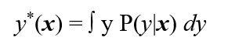
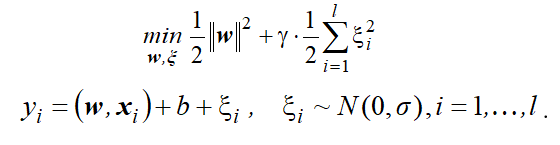
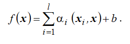
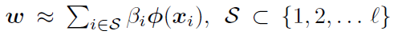
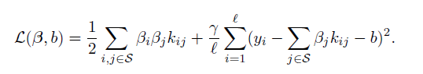
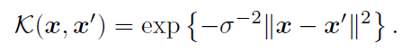

# Метод GLSL для SVM
## Постановка задачи
В некоторой среде, которая характеризуется плотностью распределения вероятностей P(**x**), случайно и независимо появляются n-мерные векторы **х** – контролируемые факторы. Каждому вектору х ставится в соответствие вещественное число у - отклик, полученное в результате реализации случайного испытания согласно закону P(y|**x**). 	Свойства среды P(**x**) и условный закон распределения P(y|**x**) неизвестны, но известно, что существует функция регрессии  
  
Требуется по случайной независимой выборке l пар (**x**1, y1), … , (**x**l, yl), таких, что   y_i  = y*(**x**_i) + E_i, восстановить регрессию, т.е. в заданном классе функций {f(**x**, a} отыскать функцию {f(**x**,a*}, наиболее близкую к регрессии y*(**x**). 
Здесь  E_i,  i=1, …, l – случайные ошибки (шум).

## Идея метода
Использование квадратичной функции потерь приводит к задаче оптимизации вида:  
  
Решение этой задачи  восстановления линейной регрессии по-прежнему будет иметь вид:  
  
Однако  такое SVM-решение, построенное на основе квадратичной функции потерь, в общем случае абсолютно плотно. В данном случае свойство разреженности решения не имеет места. Таким образом, реализация метода требует настолько больших временных затрат и такого объема памяти, что метод становится непригодным для практического использования.
На практике применяют различные "экономичные" алгоритмы для получения разреженной аппроксимации полного ядерного разложения.

Будем реализовывать один из таких алгоритмов, GSLS. Строить будем нелинейную машину. Переход от  линейного случая к нелинейному: заменяем все скалярные произведения входных векторов на соответствующие значения ядра. 
Алгоритм GSLS (Greedy Sparse Least Squares) строит разреженную аппроксимацию полного SV-разложения, включая на каждом шаге в SV-разложение тренировочный образец, минимизирующий  регуляризованный эмпирический риск.

Будем считать, что решение задачи восстановления регрессии имеет вид:  
  
Для нахождения коэффициентов для выбранного числа опорных векторов нужно решать СЛАУ  
  
и минимизировать целевую функцию  
  
по индексам вектров тренировочной последовательности.
В этой задаче gamma = C.

Шаг алгоритма состоит из конструирования СЛАУ, её решения и вычисления значения целевой функции с полученными коэффициентами. На первом шаге алгоритма для первого опорного вектора размерность системы будет 2x2. При этом осуществляется перебор всех векторов тренировочной последовательности и выбор того вектора, который дает минимум целевой функции. Это вектор принимается за первый опорный. Далее увеличивается размерность СЛАУ, учитывая уже найденные опорные вектора и перебирая оставшиеся вектора из тренировочной последовательности для поиска следующего опорного вектора.
## Алгоритм 
```
Вход:  (**x**, y) - последовательность пар тренировочной последовательности,  
       K - матрица ядра
       gamma, sigma - параметры машины
       nv - количество опорных векторов
1. Цикл от 0 до nv
  1.1 Цикл по всем индексам тренировочной последовательности, не входящим в S
      1.1.1 Построение матрицы Omega
      1.1.2 Построение ветора Ф
      1.1.3 Построение правого вектора системы v
      1.1.4 Формирование матрицы H из Omega и Ф
      1.1.5 Решение СЛАУ: H * B = v
      1.1.6 Вычисление целевой функции для коэффициентов B
  1.2 Выбор индекса тренировочной последовательности, дающего минимум целевой функции
  1.3 Добавление выбранного индекса в S (i-й опорный вектор найден)
      
Выход: B - коэффициенты функции регрессии
       S - индексы опорных векторов в тренировочной последовательности
      
```
## Настройка машины
Для использования машины опорных векторов необходима настройка, предполагающая  поиск  таких  значений гиперпараметров,  параметров  регуляризации  и  ядра,  которые  приводят  к  наиболее высокому  качеству  машины. Необходимо оценивать качество машин, получаемых в процессе настройки, а также качество обученной машины. Для этого надо определить показатели (характеристики) качества обучения.
Параметры для выбора:Ядро, C, sigma, количество опорных векторов и оценка качества обучения.
1. Ядро было выбрано Гауссово, как предлагают авторы статьи. Построение матрицы ядра:  
   
2. Оценка качества обучения производится посредством вычисления среднеквадратической ошибки(RMS) между получившимся значением функции регрессии и значением y в тренировочной последовательности
3. Выбор C и sigma происходит с помоью процедуры _k-кратной перекрёстной проверки_
4. Выбор оптимального количества опорных векторов происходит визуально, посредством оценки графика среднеквадратической ошибки от количества опорных векторов 
## Результаты
### Восстановление однофакторной регрессии по точным данным
### Восстановление однофакторной регрессии по зашумленным данным
### Зависимость среднеквадратической ошибки от количества опорных векторов
### Настройка гиперпараметров
## Литература
1. Cawley  G., and Talbot N. A Greedy Training Algorithm for Sparse Least-Squares Support Vector Machines. J.R.Dorronsoro (Ed.): ICANN 2002, LNCS 2415, pp.681-686. Springer-Verlag Berlin Heidelberg 2002

