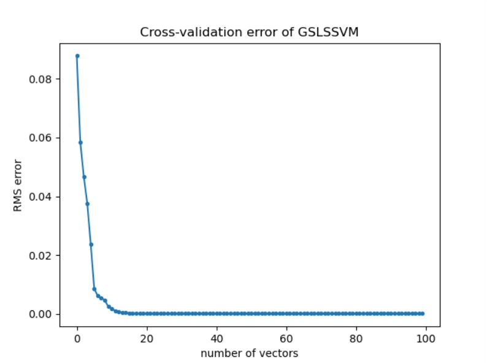
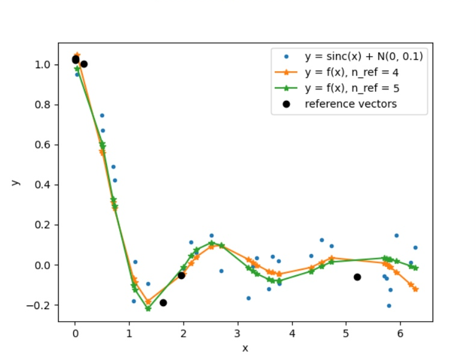

# Метод GLSL для SVM
## Постановка задачи
В некоторой среде, которая характеризуется плотностью распределения вероятностей P(**x**), случайно и независимо появляются n-мерные векторы **х** – контролируемые факторы. Каждому вектору х ставится в соответствие вещественное число у - отклик, полученное в результате реализации случайного испытания согласно закону P(y|**x**). 	Свойства среды P(**x**) и условный закон распределения P(y|**x**) неизвестны, но известно, что существует функция регрессии  
  
Требуется по случайной независимой выборке l пар (**x**1, y1), … , (**x**l, yl), таких, что   y_i  = y*(**x**_i) + E_i, восстановить регрессию, т.е. в заданном классе функций {f(**x**, a} отыскать функцию {f(**x**,a*}, наиболее близкую к регрессии y*(**x**). 
Здесь  E_i,  i=1, …, l – случайные ошибки (шум).

## Идея метода
Использование квадратичной функции потерь приводит к задаче оптимизации вида:  
  
Решение этой задачи  восстановления линейной регрессии по-прежнему будет иметь вид:  
  
Однако  такое SVM-решение, построенное на основе квадратичной функции потерь, в общем случае абсолютно плотно. В данном случае свойство разреженности решения не имеет места. Таким образом, реализация метода требует настолько больших временных затрат и такого объема памяти, что метод становится непригодным для практического использования.
На практике применяют различные "экономичные" алгоритмы для получения разреженной аппроксимации полного ядерного разложения.

Будем реализовывать один из таких алгоритмов, GSLS. Строить будем нелинейную машину. Переход от  линейного случая к нелинейному: заменяем все скалярные произведения входных векторов на соответствующие значения ядра. 
Алгоритм GSLS (Greedy Sparse Least Squares) строит разреженную аппроксимацию полного SV-разложения, включая на каждом шаге в SV-разложение тренировочный образец, минимизирующий  регуляризованный эмпирический риск.

Будем считать, что решение задачи восстановления регрессии имеет вид:  
  
Для нахождения коэффициентов для выбранного числа опорных векторов нужно решать СЛАУ  
  
и минимизировать целевую функцию  
  
по индексам вектров тренировочной последовательности.
В этой задаче gamma = C.

Шаг алгоритма состоит из конструирования СЛАУ, её решения и вычисления значения целевой функции с полученными коэффициентами. На первом шаге алгоритма для первого опорного вектора размерность системы будет 2x2. При этом осуществляется перебор всех векторов тренировочной последовательности и выбор того вектора, который дает минимум целевой функции. Это вектор принимается за первый опорный. Далее увеличивается размерность СЛАУ, учитывая уже найденные опорные вектора и перебирая оставшиеся вектора из тренировочной последовательности для поиска следующего опорного вектора.
## Алгоритм 
```
Вход:  (**x**, y) - последовательность пар тренировочной последовательности,  
       K - матрица ядра
       gamma, sigma - параметры машины
       nv - количество опорных векторов
1. Цикл от 0 до nv
  1.1 Цикл по всем индексам тренировочной последовательности, не входящим в S
      1.1.1 Построение матрицы Omega
      1.1.2 Построение ветора Ф
      1.1.3 Построение правого вектора системы v
      1.1.4 Формирование матрицы H из Omega и Ф
      1.1.5 Решение СЛАУ: H * B = v
      1.1.6 Вычисление целевой функции для коэффициентов B
  1.2 Выбор индекса тренировочной последовательности, дающего минимум целевой функции
  1.3 Добавление выбранного индекса в S (i-й опорный вектор найден)
      
Выход: B - коэффициенты функции регрессии
       S - индексы опорных векторов в тренировочной последовательности
      
```
## Настройка машины
Для использования машины опорных векторов необходима настройка, предполагающая  поиск  таких  значений гиперпараметров,  параметров  регуляризации  и  ядра,  которые  приводят  к  наиболее высокому  качеству  машины. Необходимо оценивать качество машин, получаемых в процессе настройки, а также качество обученной машины. Для этого надо определить показатели (характеристики) качества обучения.
Параметры для выбора:Ядро, C, sigma, количество опорных векторов и оценка качества обучения.
1. Ядро было выбрано Гауссово, как предлагают авторы статьи. Построение матрицы ядра:  
   
2. Оценка качества обучения производится посредством вычисления среднеквадратической ошибки(RMS) между получившимся значением функции регрессии и значением y в тренировочной последовательности.  
  
3. Выбор C и sigma происходит с помоью процедуры _k-кратной перекрёстной проверки_
4. Выбор оптимального количества опорных векторов происходит визуально, посредством оценки графика среднеквадратической ошибки от количества опорных векторов.   
## Результаты
### Настройка гиперпараметров
Для настройки гиперпараметров машины опорных векторов  используется k-кратная перекрёстная проверка. При кратности k = 3 валидационная последовательность размером 300 разбивается на 3 части( по 100 элементов) Каждая часть последовательно используется для тестирования машины при данных гиперпараметрах, объединение оставшихся частей используется для тренировки(l = 200). Перебор параметров осуществляется  для C от 2 до 2^13 * l по степеням двойки, для sigma от 0.5 до 4 с шагом 0.2. Меньшие значения C признаны нецелесообразными для данной задачи, так как не дают хоть сколько-нибудь подходящего результата.
### Восстановление однофакторной регрессии по точным данным  
В качестве точных данных сгенерированы пары чисел (x, y), x из [0, 2pi), y = sin(x)  
Размер валидационной последовательности для настройки машины l = 300, кратность перекрестной проверки k = 3
Данные представлены в файле: [точные данные](Data/model_data.txt)  
Размер тренировочной последовательности n = 300, размер тестовой последовательности 300  
Данные сгенерированы автоматически.  
Таблица среднеквадратических ошибок при настройке машины представлена в файле: [RMS_model](README/Tables/RMS_model_data.xlsx)  
В результате настройки найдены следующие значения гиперпараметров при RMS = 0,00034427:  
C =  1048576  
sigma =  2,9  
При этом из таблицы видно, что большая часть вычислений для настройки машины не принесла результатов, значения C = 524288, sigma = 0,5 так же дают ошибку порядка 10^(-4).
#### Зависимость среднеквадратической ошибки от количества опорных векторов  
Для найденных значений гиперпараметров построим график зависимости среднеквадратической ошибки от количества опорных векторов(100):  
  
По графику видно, что среднеквадратическая ошибка быстро убывает от 1 до 4 опорных векторов, и далее остается постоянно низкой. Рассмотрим график зависимости среднеквадратической ошибки от количества опорных векторов для значений [3 : 20], чтобы определить оптимальное количество опорных векторов для данной модели.  
  
Для любого количества опорных векторов больше 3 порядок ошибки остается 10^(-4), значит 4 опорных вектора можно принять за оптимальное значение.
График модельных данных и найденной функции регрессии для 3 и 4 опорных векторов:
  
### Восстановление однофакторной регрессии по зашумленным данным
В качестве зашумленных данных сгенерированы пары чисел (x, y), x из [0, 2pi), y = sin(x) + N(0, 0.1)  
Размер валидационной последовательности для настройки машины l = 300, кратность перекрестной проверки k = 3  
Данные представлены в файле: [зашумленные данные](Data/noise_data.txt)  
Размер тренировочной последовательности n = 300, размер тестовой последовательности 300  
Данные сгенерированы автоматически.  
Таблица среднеквадратических ошибок при настройке машины представлена в файле: [RMS_noise](README/Tables/RMS_noise_data.xlsx)  
В результате настройки найдены следующие значения гиперпараметров при RMS = 0,097377782:  
C =  16384  
sigma =  3,5  
При этом уже значения C = 256, sigma = 0,9 дают такой же порядок ошибки.
#### Зависимость среднеквадратической ошибки от количества опорных векторов  
Для найденных значений гиперпараметров построим график зависимости среднеквадратической ошибки от количества опорных векторов(100):  
  
По графику видно, что среднеквадратическая ошибка быстро убывает от 1 до 4 опорных векторов, и далее остается постоянно низкой. Рассмотрим график зависимости среднеквадратической ошибки от количества опорных векторов для значений [4 : 40], чтобы определить оптимальное количество опорных векторов для данной модели. Для 3 опорных векторов значение ошибки выше на несколько порядков и не позволяет оценить остальные значения.
  
Для любого количества опорных векторов больше 3 порядок ошибки остается 10^(-2), значит 4 опорных вектора можно принять за оптимальное значение.  
Тестовая последовательность зашумленных данных из 300 значений:   
  
График модельных данных и найденной функции регрессии для 3 и 4 опорных векторов на 300 значениях:  
  
График модельных данных и найденной функции регрессии для 3 и 4 опорных векторов на 30 значениях:  
  
### Решение СЛАУ
На практике, встроенные не всегда могут справится с решением систем линейных уравнений при повышении размерности и малом изменении значений. В некоторых случаях, использованный метод numpy.linalg.solve() детектировал ошибку "Numpy error: Matrix is singular", что означает нулевой определитель матрицы системы. Появление этой ошибки связано с внутренними способами решения СЛАУ данного метода и на деле не является правдой, определитель не нулевой, система имеет решение. В связи с этим, для реализации GSLS пришлось решать СЛАУ с помощью обратной матрицы. 

Постороение матрицы системы размерности n происходит в два этапа:
1. Формирование матрицы Omega размерности n - 1
   Это происходит путем добавления столбца и строки к матрице Omega(размерности n - 2), полученной на предыдущем шаге алгоритма на основании уже выбранных n - 2 опорных векторов. Столбец и строка заполняются в соответствии с тем, какой вектор из тренировочной последовательности на данный момент считается опорным. 
2. Формирование матрицы H размерности n
   Это происходит путем добавления к сформированной матрице Omega вектора и строки Ф и правого нижнего элемента l.
То есть, на обоих этапах матрица дополняется строкой и столбцом. 
Для получения обратной матрицы в этом случае применяется формула Фробениуса для блочных матриц:  
  
В нашем случае, для матрицы H: B является вектором Ф, C является строкой Ф, а D числом l и получение обратной матрицы упрощается:  
  

Таким образом, для получения обратной матрицы H необходимо:
1. Сохранить значение обратной матрицы Omega размерности n - 2
2. Вычислить обратную матрицу Omega размерности n - 1, путем добавления стобца и строки 
3. Вычислить обратную матрицу H размерности n

### Установка и использование
#### Зависимости
#### Модули
 - SVM_custom.py - настройка машины с заданными ограничениями поиска гиперпараметров, определение оптимальных значений гиперпараметров, постоение графика зависимости среднеквадтической ошибки от количества опорных векторов
 - GSLSSVM.py - главный модуль системы с реализацией машины опорных векторов
 - generation_model_data.py, generation_noise_data.py - генерация чистых и зашумленных данных по заданным функциям
 - model_plot.py, noise_plot.py - построение графика функции регресси по заданным значениям гиперапараметров и количеством опорных векторов
## Литература
1. Cawley  G., and Talbot N. A Greedy Training Algorithm for Sparse Least-Squares Support Vector Machines. J.R.Dorronsoro (Ed.): ICANN 2002, LNCS 2415, pp.681-686. Springer-Verlag Berlin Heidelberg 2002
2. Гантмахер Ф.Р. Теория матриц. – М.: Наука, 1968

